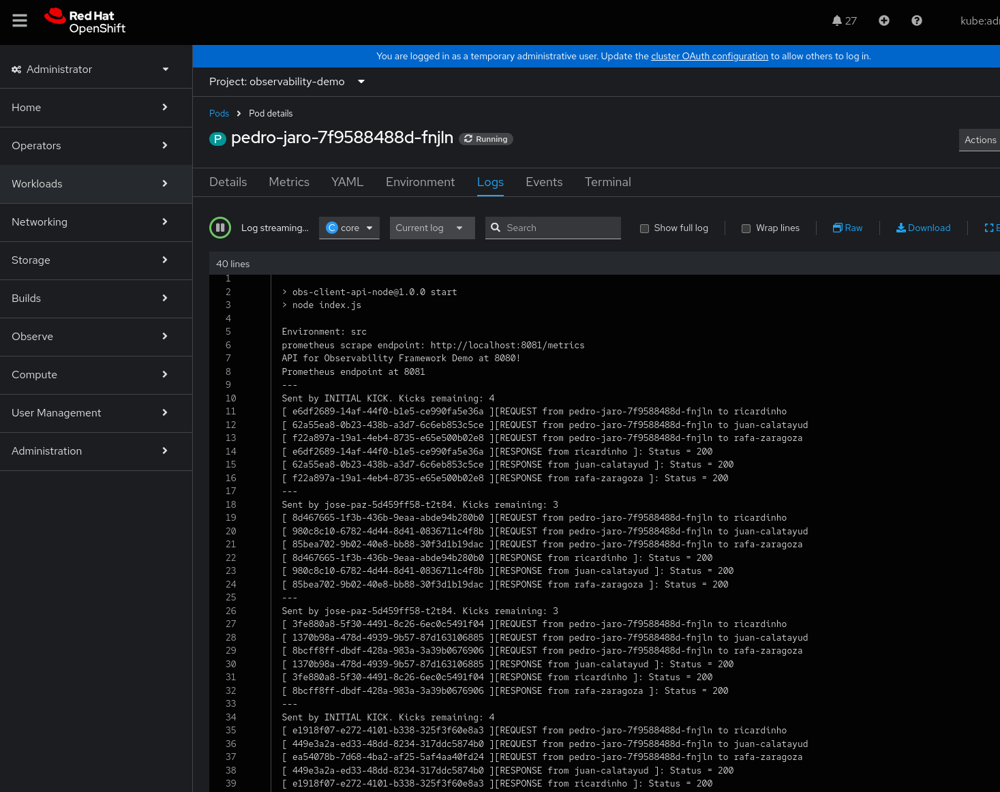

# Introduction

This repository showcases examples of the Observability features provided by Red Hat OpenShift, including metrics, logging, and tracing. The project consists of the following components:

- **Python FastAPI-based REST API**: (folder obs-main-api). This API leverages the Kubernetes Python client to interact with an OpenShift cluster, facilitating various observability operations. 
- **React 18 Frontend**: A modern frontend application built with ReactJS that interacts with the FastAPI backend to display observability data in a user-friendly interface.
- **Client Microservice API**: A blueprint for microservices deployed within OpenShift pods. This microservice enables the creation and modification of custom Prometheus metrics, facilitating real-time metric collection and management. It also establishes communication paths to interact with other microservices, supporting scalable and efficient observability across distributed systems. Currently, the repository only contains a NodeJS based one with one operation.

# Deployment model. 
 
All applications are deployed to an OpenShift cluster as ImageStreams. Each application's dedicated folder contains a `deploy.sh` script, which uses a binary BuildConfig to create a new image and deploy it as needed.

The Python API is currently exposed through an OpenShift Route, but it does not yet have authentication or authorization (authZ) functionality.

## Python API Deployment and Configuration

- **Cluster Deployment**: When deployed to the OpenShift cluster, the Python API utilizes the underlying service account to manage OpenShift resources.
- **Local Deployment**: If running the API locally, it relies on the kubeconfig file from a valid oc login session to connect to the cluster.
- **Testing Mode**: For testing purposes, a cluster is not required. The API can be started with mock components, enabling full functionality without interacting with a live OpenShift environment.

## Bootstrap process

During the bootstrap process, the main API creates instances of two classes that implement the following interfaces:

- **ClusterConnectorInterface**
- **AgentManagerInterface**

These interfaces allow the API to abstract cluster management and agent interaction logic. The behavior of the API can be controlled using environment variables:

- Setting `CLUSTER_CONNECTOR=mock` instructs the API to use a mock version for connecting to the OpenShift cluster.
- Setting `AGENT_MANAGER=mock` allows the interaction with client APIs to be mocked.

Below is the architecture diagram that illustrates this process:

A route is created for both Front and Back ends. The Frontend is generated in the container at build time, and the API address taken for injecting it as .env variable in the final build. The build process will retrieve the route address and set the `REACT_APP_OBSERVABILITY_DEMO_API` to it. 

# Frontend simple usage

The primary goal of this API is to provide an automated way to **mock microservice communication paths** and **generate telemetry** in a customizable manner. The provided frontend allows you to:

- Model communication paths between microservices.
- Manage custom Prometheus gauge metrics.
- Perform a **Kick operation**, which triggers a sequence of interactions between agents along a defined communication path.

### Kick Operation

A **Kick operation** is initiated by the "kicker" agent, sending a message to all its next hops with a counter set to `4`. Each receiving agent repeats this process, decrementing the counter by `1` until the counter reaches zero. This operation generates telemetry traces across the communication path, which can be visualized in Jaeger.

### Agent Naming

The agents are named after historic players from **Málaga CF** and **CD Málaga** football teams. This is a **very important requirement** for the system.

### Example: Communication Model

Below is an example of a communication model created in the frontend:

### Example: Agent Metrics

Here is an example of Prometheus metrics configured for the agent named `fabrice-olinga`:

### Example: Cluster Metrics

And here’s how these metrics appear within the OpenShift cluster:

### Pod Logs

You can access pod information directly from the frontend by clicking the pod name in the agent details section. Below is an example of the logs generated after a Kick operation:

### Tracing with Jaeger

From the frontend, you can click the **Jaeger button** to navigate to the Jaeger UI, where traces of the Kick operation are displayed:

