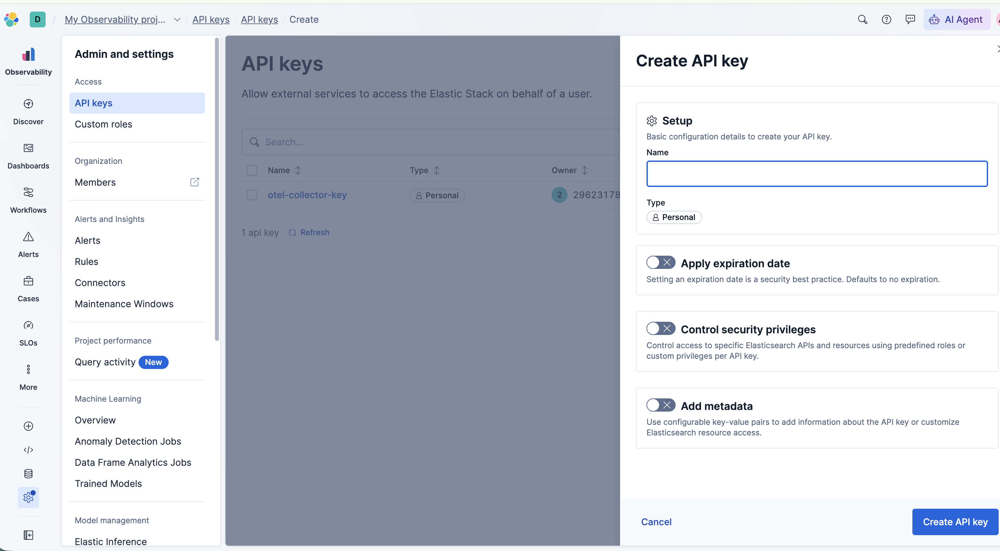
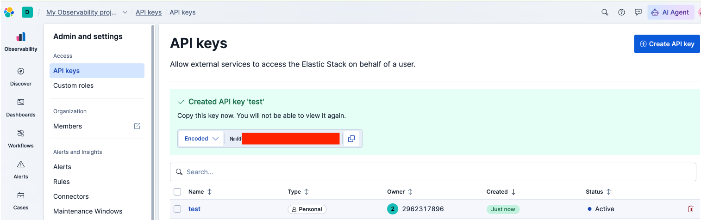

# OpenTelemetry Collector Integration with Elastic Cloud (Serverless on AWS)

This guide provides a walkthrough on how to deploy and configure an OpenTelemetry (OTel) Collector to receive telemetry data (logs and traces) from your applications and export it to an Elastic Cloud Serverless project hosted on AWS.

## 📋 Prerequisites

Before starting, ensure you have the following ready:
* A working Kubernetes/OpenShift cluster.
* The **OpenTelemetry Operator** (e.g., Red Hat build of OpenTelemetry) installed on your cluster.
* Applications deployed in the cluster that are already instrumented to emit logs and traces in **OTLP format** (e.g., via the `Instrumentation` CRD).

---

## 🔑 Step 1: Obtain Elastic Cloud Credentials

To allow the OTel Collector to push data to Elastic, you need two pieces of information from your Elastic Cloud console: the **Ingest Endpoint** and an **API Key**.

### Finding the Ingest Endpoint
1. Log in to [cloud.elastic.co](https://cloud.elastic.co).
2. Locate your Serverless **Observability Project**.
3. Click the **Manage** button next to your project.
4. Look for the **Endpoints** section (or "Application endpoints, cluster and component IDs").
5. Copy the URL labeled **Ingest** or **Managed OTLP**. 
   * *Note: Ensure it is the Ingest/APM endpoint (typically contains `.ingest.` or `.apm.`), NOT the Elasticsearch database endpoint (which contains `.es.`).*

### Generating the API Key
1. In the same project management screen, navigate to the **API Keys** section.
2. Click **Create API Key**.
3. Give it a descriptive name (e.g., `otel-collector-exporter`).
4. Copy the generated Base64 API Key. **Save it securely**, as you will not be able to see it again.





---

## 🚀 Step 2: Deploy the OTel Collector

The following script creates the required `ServiceAccount` and deploys the `OpenTelemetryCollector` custom resource. The collector is configured to receive OTLP data internally via gRPC/HTTP and export it using the robust `otlp_http` protocol to Elastic.

> **⚠️ Security Warning:** For demonstration and laboratory purposes, the API key is hardcoded in the `headers` section below. For production environments, you should store this key in a Kubernetes `Secret` and reference it in the collector configuration using environment variables.

Run the following commands in your terminal, replacing the placeholders with your actual Elastic data:

```bash
export CURRENT_NAMESPACE=obs-demo

# 1. Create the ServiceAccount
echo " - Creating Service Account"
cat <<EOF | oc apply -f -
apiVersion: v1
kind: ServiceAccount
metadata:  
  name: otel-collector
  namespace: $CURRENT_NAMESPACE
EOF

# 2. Install the OTel Collector
echo " - Installing OTel Collector"
cat <<EOF | oc apply -f -  
apiVersion: opentelemetry.io/v1beta1
kind: OpenTelemetryCollector
metadata:
  name: otel
  namespace: $CURRENT_NAMESPACE
spec:
  observability:
    metrics:
      enableMetrics: true
  config:
    exporters:      
      otlp_http/elastic:
        # REPLACE with your Elastic Ingest/APM URL (ensure it starts with https://)
        endpoint: 'https://<YOUR_INGEST_ENDPOINT>'
        tls:
          insecure: false
        headers:
          # REPLACE with your actual API Key
          Authorization: 'ApiKey <YOUR_API_KEY>'          
    receivers:
      otlp:
        protocols:
          grpc:
            endpoint: '0.0.0.0:4317'
          http:
            endpoint: '0.0.0.0:4318'            
    service:
      pipelines:
        logs:
          exporters:
            - otlp_http/elastic
          receivers:
            - otlp
        traces:
          exporters:
            - otlp_http/elastic
          receivers:
            - otlp            
  mode: deployment
  managementState: managed  
  serviceAccount: otel-collector
EOF
```

## 🧪 Step 3: Verification

Once the pod for the OpenTelemetry Collector is in a `Running` state, it will start receiving data from your apps and forwarding it.

To verify that the pipeline is working:

1. Open your Elastic Cloud project UI (Kibana).

2. For Logs: Go to Discover or Observability -> Logs -> Stream. You should see your application logs flowing in.

3. For Traces: Go to Observability -> APM -> Services. You should see your instrumented application listed. Click on it to explore the transaction waterfalls and trace data.
