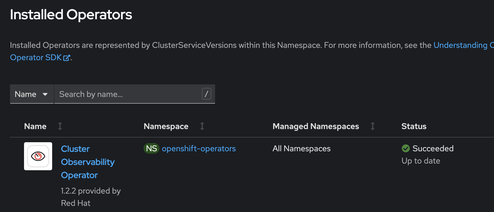

# Step by step instructions

- [Step by step instructions](#step-by-step-instructions)
	- [Requirements](#requirements)
	- [1. Create a cluster for this to run on](#1-create-a-cluster-for-this-to-run-on)
	- [2. Clone the repository locally](#2-clone-the-repository-locally)
	- [Create a NS for all of this](#create-a-ns-for-all-of-this)
	- [3. Install operators](#3-install-operators)
		- [3.1 COO](#31-coo)
		- [3.2 Enable user workload monitoring](#32-enable-user-workload-monitoring)
		- [3.3 Install Loki](#33-install-loki)
		- [3.4 Install tempo](#34-install-tempo)
		- [3.5 otel](#35-otel)
		- [Install keycloack](#install-keycloack)
	- [4 Apps](#4-apps)
		- [4.1 Clients](#41-clients)
			- [4.1.1 Nodejs](#411-nodejs)
			- [4.1.2 dotnet](#412-dotnet)
		- [4.2 Main API](#42-main-api)
		- [4.3 Front](#43-front)
	- [5 Get the frontend URL](#5-get-the-frontend-url)

## Requirements

- Install `az`

## 1. Create a cluster for this to run on

Make sure the cluster name is no longer than 16 chars!

## 2. Clone the repository locally

```bash
git clone https://github.com/CSA-RH/observability-demo-framework.git
```

## Create a NS for all of this

```bash
oc new-project obs-demo
```

## 3. Install operators

### 3.1 COO

```bash
cd /operators
./deploy-coo.sh
```



### 3.2 Enable user workload monitoring

In the /operators folder, run

```bash
./deploy-monitoring.sh
```


### 3.3 Install Loki

In the /operators folder, run

```bash
./deploy-loki.sh
```


### 3.4 Install tempo

```bash
./deploy-tempo.sh
```


### 3.5 otel

```bash
./deploy-otel.sh
```


### Install keycloack

```bash
./deploy-keycloak.sh
```


To get the keycloak admin password


To get the keycloak route


## 4 Apps

### 4.1 Clients

#### 4.1.1 Nodejs

```bash
cd observability-demo-framework/obs-clients/obs-client-api-node/scripts/
./deploy.sh
```

#### 4.1.2 dotnet

```bash
cd observability-demo-framework/obs-clients/obs-client-api-dotnet/
./deploy.sh
```

### 4.2 Main API

```bash
cd observability-demo-framework/obs-main-api/scripts/
./deploy.sh
```

### 4.3 Front

```bash
cd observability-demo-framework/obs-front/
./deploy.sh
```

## 5 Get the frontend URL


Log in with the keycloak users
